# Cline项目架构分析

## 项目概述
Cline是一个VSCode扩展，提供AI助手功能，结合了核心扩展后端和React-based webview前端。项目使用TypeScript开发，采用模块化架构。

## 架构设计原则
1. **分层架构**：清晰的UI层、核心扩展层、外部服务层分离
2. **模块化设计**：每个组件有明确的职责边界
3. **状态集中管理**：Controller作为单一数据源
4. **扩展性**：支持多AI提供商和MCP工具扩展
5. **安全性**：用户批准机制和安全的工具执行

## 高层架构图

```mermaid
graph TB
    %% 用户界面层
    subgraph "用户界面层"
        VSCodeUI[VSCode UI<br/>侧边栏/编辑器面板]
        WebviewUI[Webview UI<br/>React应用]
        User[用户交互]
    end

    %% 核心扩展层
    subgraph "核心扩展层 (VSCode Extension Host)"
        ExtensionEntry[扩展入口点<br/>src/extension.ts]
        
        subgraph "Webview管理"
            WebviewProvider[WebviewProvider<br/>管理Webview生命周期]
            VscodeWebviewProvider[VscodeWebviewProvider<br/>VSCode特定实现]
        end
        
        subgraph "控制器层"
            Controller[Controller<br/>状态管理和任务协调]
            StateManager[StateManager<br/>状态持久化]
            McpHub[McpHub<br/>MCP服务器管理]
        end
        
        subgraph "任务执行层"
            Task[Task<br/>AI请求和工具执行]
            APIManager[API管理器<br/>多提供商支持]
            ToolExecutor[工具执行器<br/>文件/终端/浏览器]
        end
        
        subgraph "存储层"
            GlobalState[VSCode全局状态]
            SecretsStorage[密钥存储]
            TaskStorage[任务存储<br/>文件系统]
            CheckpointSystem[Git检查点系统]
        end
    end

    %% 外部服务层
    subgraph "外部服务层"
        subgraph "AI API提供商"
            Anthropic[Anthropic Claude]
            OpenRouter[OpenRouter]
            AWSBedrock[AWS Bedrock]
            Gemini[Google Gemini]
            Ollama[Ollama本地模型]
        end
        
        subgraph "MCP服务器"
            ExternalMcpServers[外部MCP服务器]
            McpMarketplace[MCP市场]
        end
        
        subgraph "认证服务"
            ClineAuth[Cline认证]
            OCA[OCA认证]
            OpenRouterAuth[OpenRouter认证]
        end
    end

    %% 数据流 - 用户交互
    User --> VSCodeUI
    VSCodeUI --> ExtensionEntry
    ExtensionEntry --> WebviewProvider
    WebviewProvider --> VscodeWebviewProvider
    
    %% 数据流 - Webview通信
    VscodeWebviewProvider <-->|postMessage/grpc| WebviewUI
    VscodeWebviewProvider --> Controller
    
    %% 数据流 - 控制器协调
    Controller --> StateManager
    Controller --> McpHub
    Controller --> Task
    
    %% 数据流 - 任务执行
    Task --> APIManager
    APIManager --> Anthropic
    APIManager --> OpenRouter
    APIManager --> AWSBedrock
    APIManager --> Gemini
    APIManager --> Ollama
    
    Task --> ToolExecutor
    ToolExecutor -->|文件操作| TaskStorage
    ToolExecutor -->|终端命令| VSCodeTerminal
    ToolExecutor -->|浏览器自动化| HeadlessBrowser
    
    %% 数据流 - MCP集成
    McpHub --> ExternalMcpServers
    McpHub --> McpMarketplace
    Task -->|使用MCP工具| McpHub
    
    %% 数据流 - 认证
    Controller --> ClineAuth
    Controller --> OCA
    Controller --> OpenRouterAuth
    
    %% 数据流 - 状态持久化
    StateManager --> GlobalState
    StateManager --> SecretsStorage
    StateManager --> TaskStorage
    Task --> CheckpointSystem
    
    %% 样式定义
    classDef ui fill:#e1f5fe,stroke:#01579b
    classDef core fill:#f3e5f5,stroke:#4a148c
    classDef service fill:#e8f5e8,stroke:#1b5e20
    classDef storage fill:#fff3e0,stroke:#e65100
    
    class VSCodeUI,WebviewUI,User ui
    class ExtensionEntry,WebviewProvider,VscodeWebviewProvider,Controller,StateManager,McpHub,Task,APIManager,ToolExecutor core
    class Anthropic,OpenRouter,AWSBedrock,Gemini,Ollama,ExternalMcpServers,McpMarketplace,ClineAuth,OCA,OpenRouterAuth service
    class GlobalState,SecretsStorage,TaskStorage,CheckpointSystem storage
```



## 关键组件详解

### 1. 扩展入口点 (`src/extension.ts`)
- VSCode扩展的激活入口
- 注册命令、Webview提供者、URI处理器
- 初始化HostProvider和测试模式

### 2. Webview管理 (`src/core/webview/`)
- **WebviewProvider**: 管理Webview生命周期和通信
- **VscodeWebviewProvider**: VSCode特定的Webview实现
- 支持HMR开发和多实例管理

### 3. 控制器层 (`src/core/controller/`)
- **Controller**: 状态管理和任务协调的单一点
- **StateManager**: 状态持久化（全局状态、工作区状态、密钥）
- **McpHub**: MCP服务器连接和管理

### 4. 任务执行层 (`src/core/task/`)
- **Task**: AI请求执行和工具操作
- **API管理器**: 多AI提供商支持（Anthropic、OpenRouter等）
- **工具执行器**: 文件操作、终端命令、浏览器自动化

### 5. 存储层
- **VSCode全局状态**: 跨会话的扩展设置
- **密钥存储**: 安全的API密钥存储
- **任务存储**: 文件系统上的任务历史记录
- **Git检查点系统**: 文件变更的版本控制

## 数据流分析

### 用户交互流程
1. 用户在VSCode中与Cline交互
2. VSCode UI触发扩展命令
3. 扩展入口点初始化Webview
4. Webview与React前端通信

### 任务执行流程
1. Controller创建Task实例
2. Task通过API管理器调用AI服务
3. AI返回工具调用指令
4. 工具执行器执行操作（文件、终端、浏览器）
5. 结果返回给AI进行下一步处理

### 状态管理流程
1. Controller通过StateManager读写状态
2. 状态持久化到VSCode存储和文件系统
3. 状态变更同步到Webview UI

### MCP集成流程
1. McpHub管理MCP服务器连接
2. Task通过McpHub调用MCP工具
3. 工具结果返回给AI处理

## 架构优势

1. **清晰的职责分离**: 每个组件有明确的单一职责
2. **可扩展性**: 支持多AI提供商和MCP工具
3. **状态一致性**: 集中式状态管理确保数据一致性
4. **安全性**: 用户批准机制和安全的工具执行
5. **可维护性**: 模块化设计便于测试和维护

## 目录结构映射

```
src/
├── extension.ts                    # 扩展入口点
├── core/
│   ├── webview/                   # Webview管理
│   ├── controller/                # 控制器层
│   ├── task/                      # 任务执行
│   ├── storage/                   # 状态管理
│   └── workspace/                 # 工作区管理
├── api/                           # API提供商集成
├── services/                      # 服务层（MCP、认证等）
├── hosts/                         # 主机适配器
└── shared/                        # 共享类型和工具
```

## 技术栈
- **语言**: TypeScript
- **前端**: React + Vite + Tailwind CSS
- **通信**: VSCode Webview API + gRPC
- **AI集成**: 多提供商支持（Anthropic、OpenRouter等）
- **工具协议**: Model Context Protocol (MCP)
- **构建工具**: esbuild + Biome

这个架构分析提供了Cline项目的高层概览，重点关注数据流和组件交互。如需更详细的分析，可以进一步探索特定模块的实现细节。
